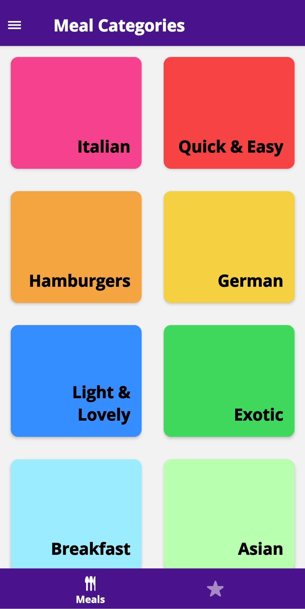

# Cross Platform Meals App

## Screenshots
     

## Available Scripts

In the project directory, you can run:

### `yarn start` or you can directly run `expo start`

but first make sure you install the dependencies using 

### `yarn install` or, if you prefer `npm install`
